## Intro

Minecraft is a great medium to toy around with cutting-edge technologies, and many tutorials talking about them recently. However, in this post, we design and deploy them in production which presents more challenges and problem-solving.

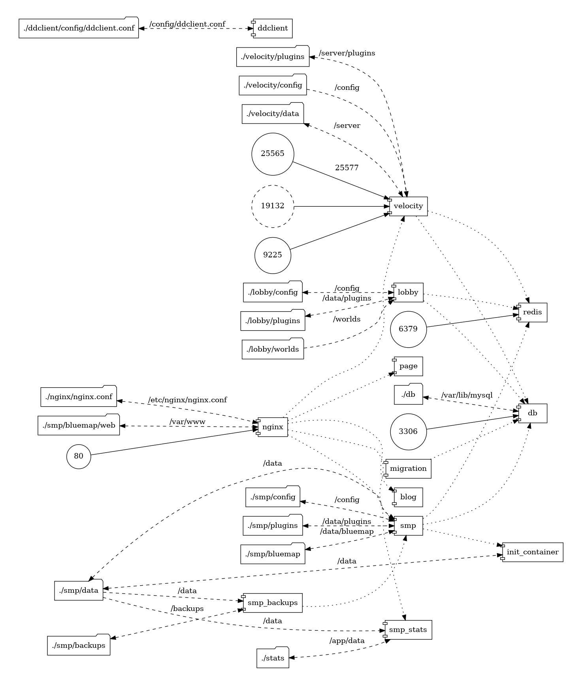

> **_NOTE:_** Building a Minecraft Server isn't all about using **Paper** or **Velocity**.

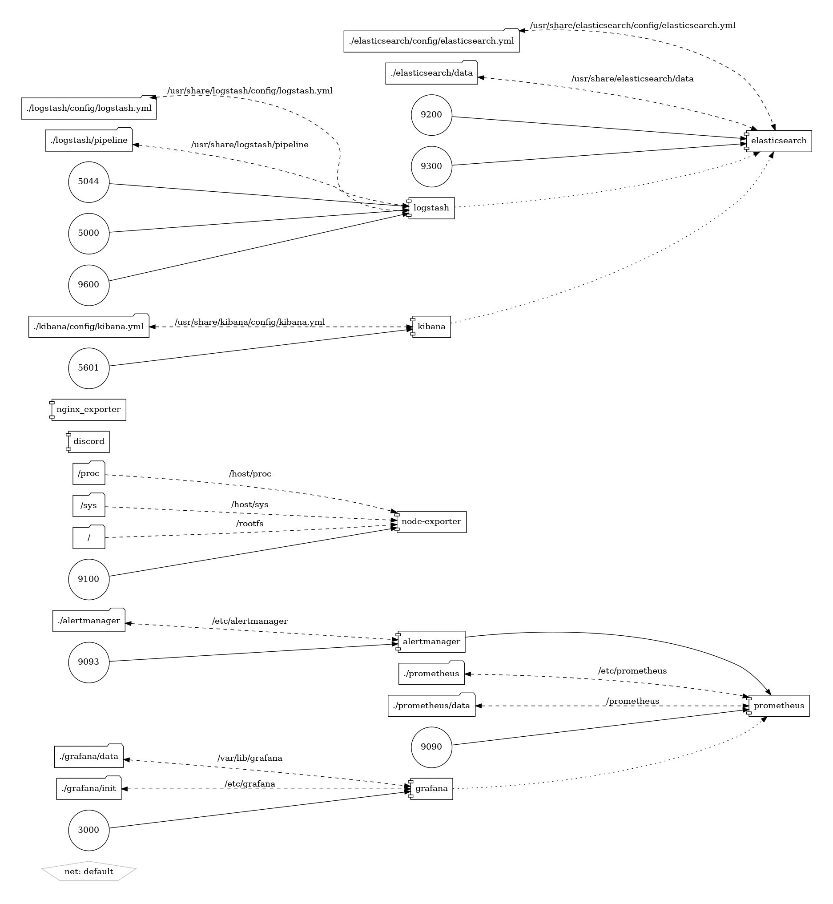

> **_NOTE:_** We will deep dive into this infrastructure and what problem it solves.

## Problems

I will share a problem first and a way I solved it. Many interesting problems are common and already solved by the tech community.

### How can a team work together to build the server?


> **_NOTE:_** **Git** is a version control system for tracking changes in any set of files

Before we use `Git`, we need to figure out what files need to be tracked, and put any unrelated files like logs, and user data into `.gitignore`.

```sh
# plugins
**/plugins/GriefPreventionData/Logs
**/plugins/GriefPreventionData/PlayerData
**/plugins/GriefPreventionData/softMute.txt
**/plugins/LuckPerms/translations
**/plugins/LuckPerms/libs
**/plugins/WorldGuard/cache
**/plugins/WorldGuard/worlds
**/plugins/WorldEdit/.archive-unpack
**/plugins/WorldEdit/sessions

# smp
**/smp/data
**/smp/backups
**/smp/bluemap/web/data
**/smp/bluemap/web/assets/playerheads
**/smp/plugins/BlueMapFloodgate/playerheads

# lobby
**/lobby/data
**/lobby/worlds/world/advancements
**/lobby/worlds/world/playerdata
**/lobby/worlds/world/stats
**/lobby/worlds/world/uid.dat
**/lobby/worlds/world/session.lock
**/lobby/worlds/world/data/raids.dat

# velocity
**/velocity/data
**/velocity/plugins/luckperms/luckperms-h2.mv.db
**/velocity/plugins/luckperms/libs
**/velocity/plugins/luckperms/translations
```

> **_NOTE:_** A giant list of ignored files including logs, data, and images

Sometimes, the config that we want to track has meaningless changes made by the server. We can solve the issue by using a one-way file synchronization system.

1. When the source file is updated in Git, replace the file used by the server.
2. When the file is updated by the server, keep using it but don't sync the changes to Git.
3. Note if the server added some missing properties to a file, it is not tracked. Even if it gets overwritten, the server will just add the missing properties again, therefore there is no harm but you just won't know.

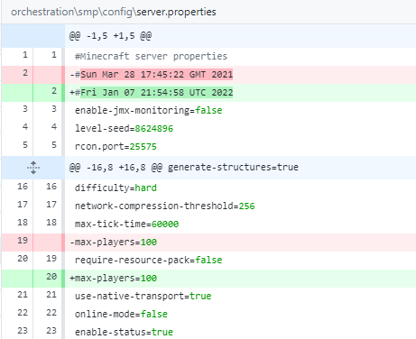

> **_NOTE:_** We don't want to track useless updates like updated timestamps, or the configs get a random order.

### Why do I need containers?


Containers allow apps to be easily and rapidly deployed, patched, or scaled.
Containers accelerate development, test, and production cycles.
Minecraft has many containers available and they are well-maintained:

1. [itzg/minecraft-server](https://hub.docker.com/r/itzg/minecraft-server)
2. [itzg/bungeecord](https://hub.docker.com/r/itzg/bungeecord)
3. [itzg/minecraft-bedrock-server](https://hub.docker.com/r/itzg/minecraft-bedrock-server)

### Should I use flat files or databases?

> Minecraft Java Edition uses file storage like MCRegion or Anvil format. In comparison, Bedrock Edition uses a modified version of Google's Level Database.

We should use a database if the plugin supports it and most competent plugin developers will support MySQL. My three reasons for picking databases over flat files:

1. Databases have standard interface SQL or NoSQL, but there are no automation in flat files.
2. Databases are more flexible, reliable, and performant.
3. Databases improved storage efficiency and security.

### How can I see what is happening and what players are doing?

When you run a Minecraft server, you don't have much insight into what is happening unless you are logged in the game. The following web apps are used to increase the visibility of your Minecraft server, and they run in your browser.

### Map

BlueMap supports 2D/3D/player perspective, real-time player positions, and more.


> **_NOTE:_** BlueMap generates 3d-maps of the Minecraft worlds and render them real-time in your browser.

I fronted `BlueMap` with `Nginx` because BlueMap's internal web server is not robust enough. I also enabled `Cloudflare` caching for the map to save cost.

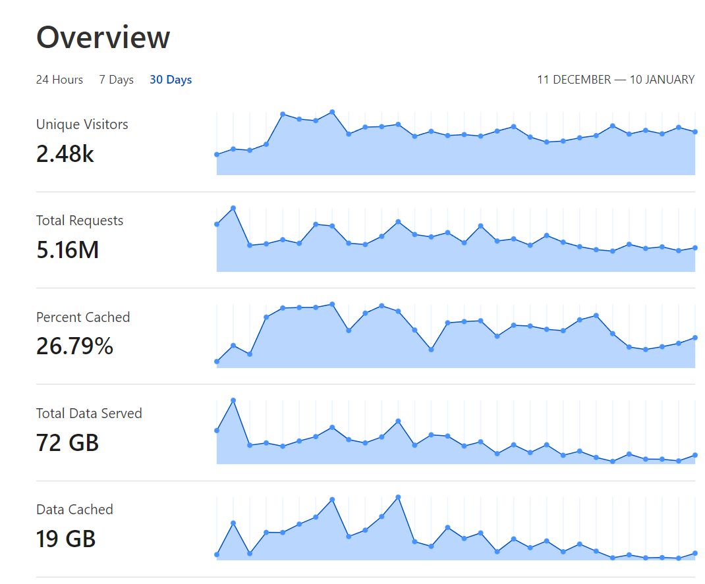

> **_NOTE:_** **Cloudflare** is the world’s #1 ranked Content Delivery Network, and you can use it for free.

### Player Statistics


> **_NOTE:_** **MinecraftStats** exports hundreds of in-game statistics so that users can view them in the browser.

We can create a sidecar container that mounts the read-only Minecraft server volume and uses Python to export player stats into JSON files. The container will auto-detect files changes and push them to GitHub. GitHub Pages automatically build and deploy the stats web page.

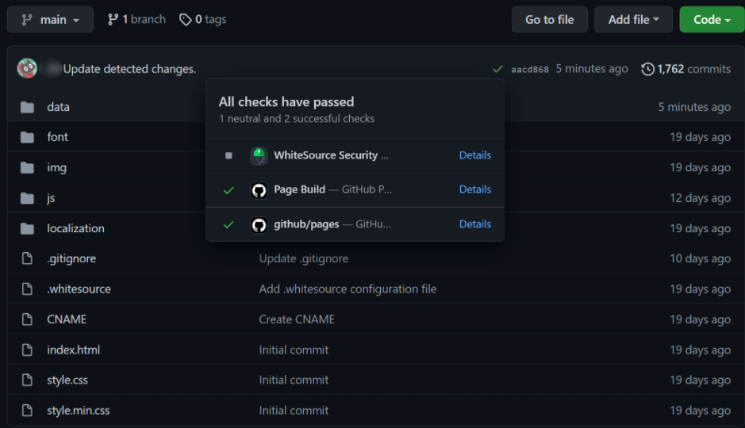

> **_NOTE:_** Sidecar container has a cron that runs the task in an interval and the bot pushes the data for **GitHub Pages**

### How can I monitor the server?

Introducing `Grafana`, `Prometheus`, and `AlertManager` to our infrastructure.


> **_NOTE:_** **Grafana**, **Prometheus**, and **AlertManager** are open-source software, and together they form a monitoring system with a dimensional data model, flexible query language, efficient time-series database, and modern alerting approach.

[dockprom](https://github.com/stefanprodan/dockprom) spins up all three services in one command. Prometheus scrapes endpoints and stores the data for Grafana visualization.

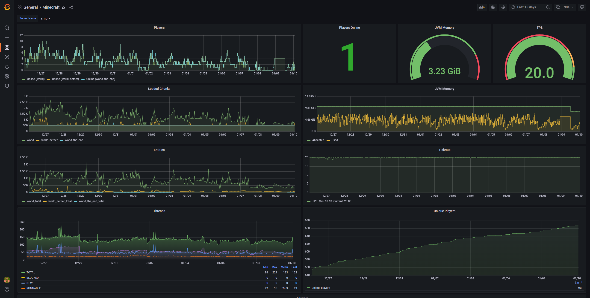

> **_NOTE:_** Minecraft Prometheus Exporter plugin exports Minecraft stats for Prometheus.

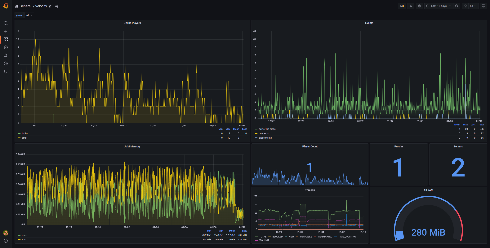

> **_NOTE:_** Bungeecord Prometheus Exporter plugin exports Bungeecord/Velocity stats for Prometheus.

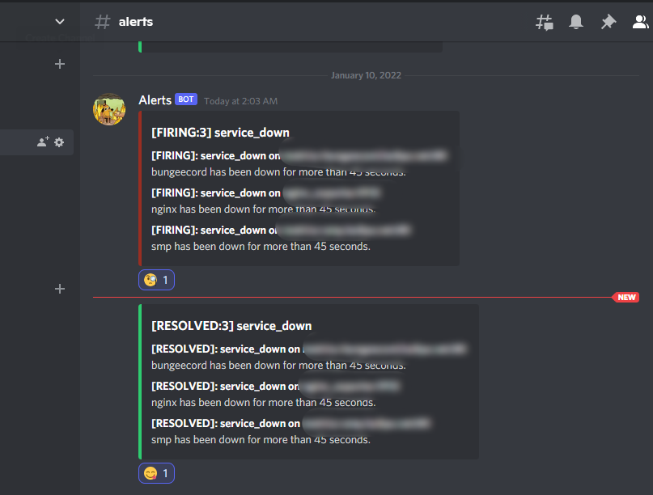

> **_NOTE:_** AlertManager notifies discord, and sends me a text message when the server is down.

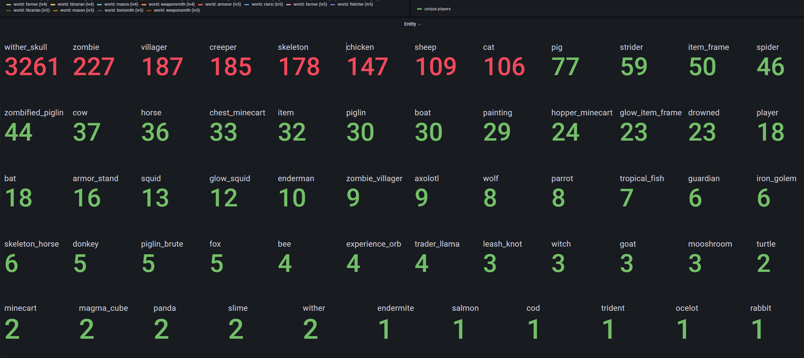

> **_NOTE:_** I made the dashboard publicly accessible for players so they also have insights. In this case, an unbounded wither farm generated over 3K skulls and is causing server lag.

### How can I search through my server logs?

Minecraft server uses log4j and outputs the log to `latest.log`, and also compresses logs into gzip archive files.

```sh
-rw-rw-r-- 1 admin admin   3355 Jan  1 00:49 2022-01-01-1.log.gz
-rw-rw-r-- 1 admin admin   2902 Jan  1 00:50 2022-01-01-2.log.gz
-rw-rw-r-- 1 admin admin  45860 Jan  2 00:06 2022-01-01-3.log.gz
-rw-rw-r-- 1 admin admin   1728 Jan  2 01:18 2022-01-02-1.log.gz
-rw-rw-r-- 1 admin admin 108339 Jan  3 00:53 2022-01-02-2.log.gz
-rw-rw-r-- 1 admin admin  33147 Jan  4 00:01 2022-01-03-1.log.gz
-rw-rw-r-- 1 admin admin  68437 Jan  5 00:05 2022-01-04-1.log.gz
-rw-rw-r-- 1 admin admin  24910 Jan  5 02:52 2022-01-05-1.log.gz
-rw-rw-r-- 1 admin admin  18207 Jan  5 06:39 2022-01-05-2.log.gz
-rw-rw-r-- 1 admin admin  19774 Jan  6 00:00 2022-01-05-3.log.gz
-rw-rw-r-- 1 admin admin   1423 Jan  6 00:00 2022-01-06-1.log.gz
-rw-rw-r-- 1 admin admin  37541 Jan  7 00:01 2022-01-06-2.log.gz
-rw-rw-r-- 1 admin admin  53038 Jan  7 20:36 2022-01-07-1.log.gz
-rw-rw-r-- 1 admin admin   4704 Jan  8 00:28 2022-01-07-2.log.gz
-rw-rw-r-- 1 admin admin  14767 Jan  9 01:38 2022-01-08-1.log.gz
-rw-rw-r-- 1 admin admin  18577 Jan  9 03:27 2022-01-09-1.log.gz
-rw-rw-r-- 1 admin admin  46618 Jan  9 07:08 2022-01-09-2.log.gz
-rw-rw-r-- 1 admin admin  21783 Jan  9 17:13 2022-01-09-3.log.gz
-rw-rw-r-- 1 admin admin   6616 Jan 10 00:04 2022-01-09-4.log.gz
-rw-rw-r-- 1 admin admin  23406 Jan 11 00:00 2022-01-10-1.log.gz
```

> **_NOTE:_** It is very difficult to search through the Minecraft server log because they are segmented.

Introducing ELK stack to our infrastructure. Elasticsearch is a search and analytics engine. Logstash is a server‑side data processing pipeline that ingests data from multiple sources simultaneously, transforms it, and then sends it to a "stash" like Elasticsearch. Kibana lets users visualize data with charts and graphs in Elasticsearch.

You can deploy ELK stack in one command using [docker-elk](https://github.com/deviantony/docker-elk)!

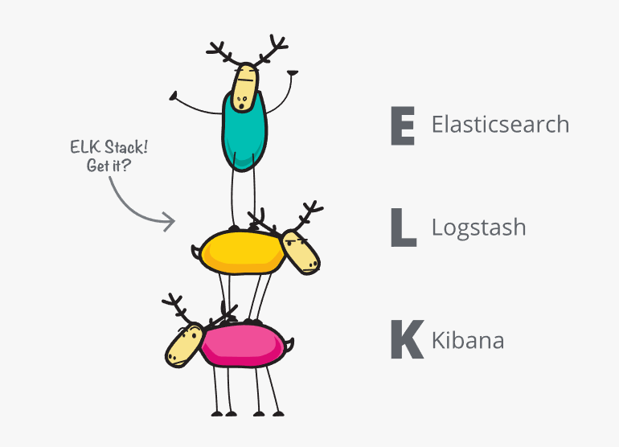

> **_NOTE:_** "ELK" is the acronym for three open source projects: Elasticsearch, Logstash, and Kibana.

There are many ways to send a log to ElasticSearch. You could use `filebeat` to tail the `latest.log`, or use a `logstash` module that works with Minecraft server log4j.

However, we want something generic that works with our containerized Minecraft server or any containers. So we use a logstash agent to send docker container logs to `Redis` for temporary storage. And a central logstash agent will pull from `Redis` and push them to `ElasticSearch`. Finally, we have `Kibana` that reads from `ElasticSearch` and visualizes the logs.

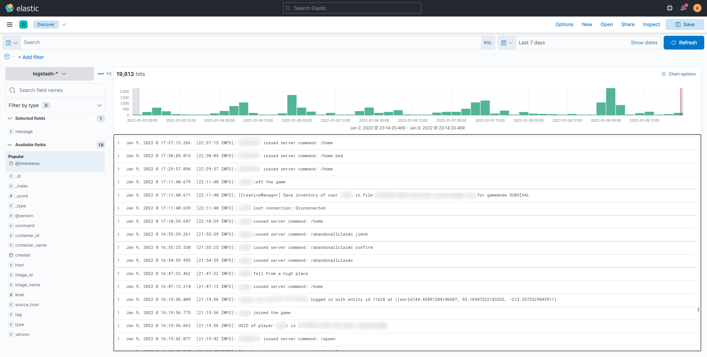

> **_NOTE:_** You can visualize, filter, and search Minecraft server logs.

### How do I setup all of these technologies?


**Ansible** does just that. It is an open-source software provisioning, configuration management, and application-deployment tool enabling infrastructure as code.

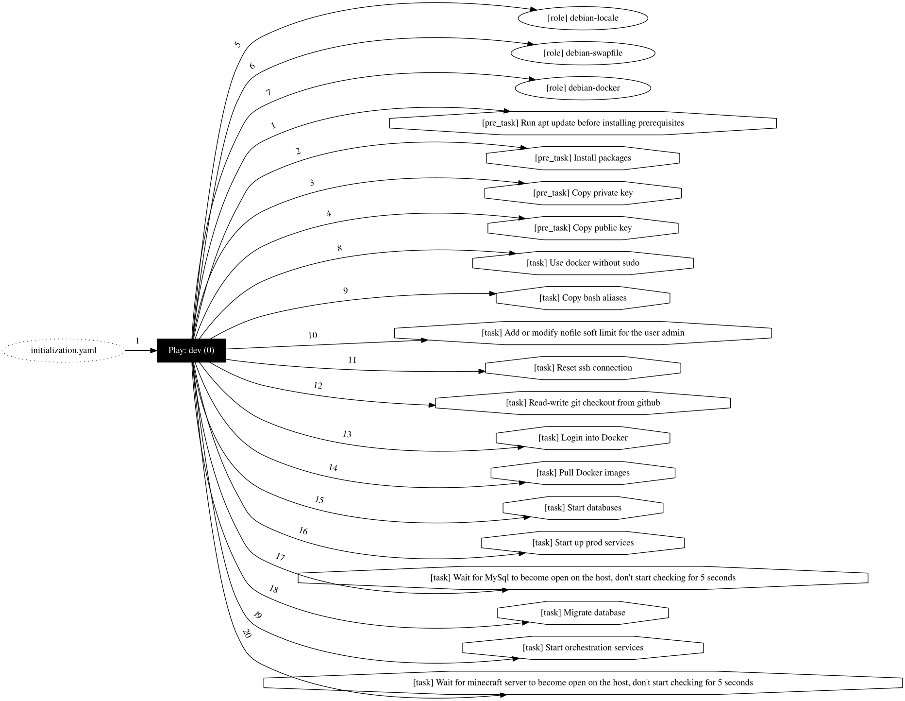

> **_NOTE:_** **Ansible** automates setting up everything.

### How do I fix crashes in production?

Sometimes everything runs well in the local development environment, but the server crashes constantly for the production environment. Luckily we had set up many metrics that can help us. The first step is to use **Kibana** to find any errors.

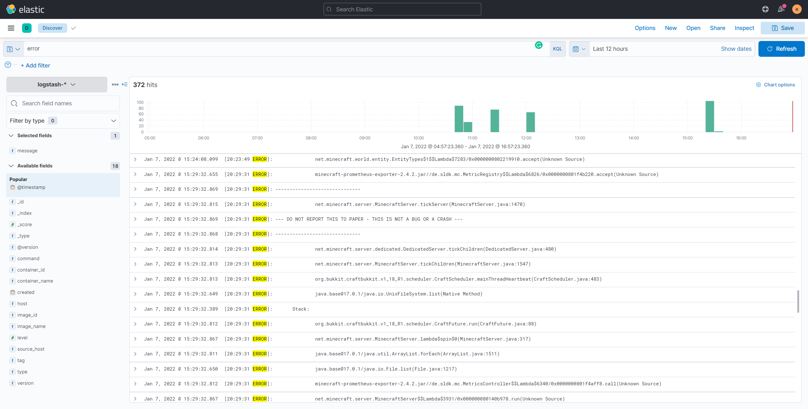

> **_NOTE:_** Searching for errors for the past 12 hours in the log.

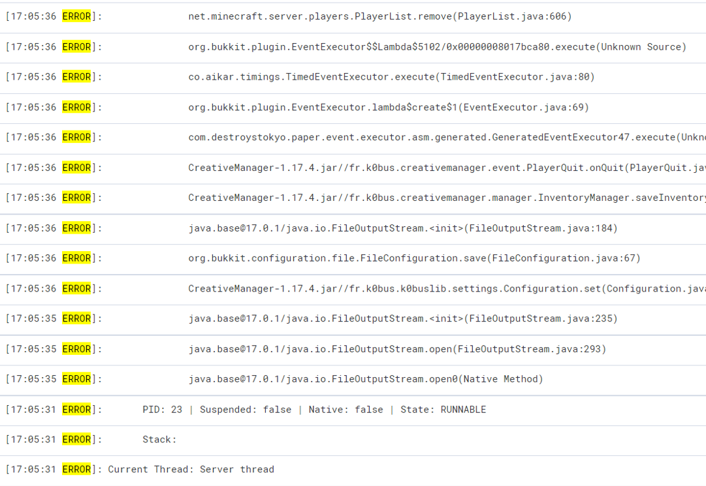

> **_NOTE:_** Java is hung when opening files and crashed the server.

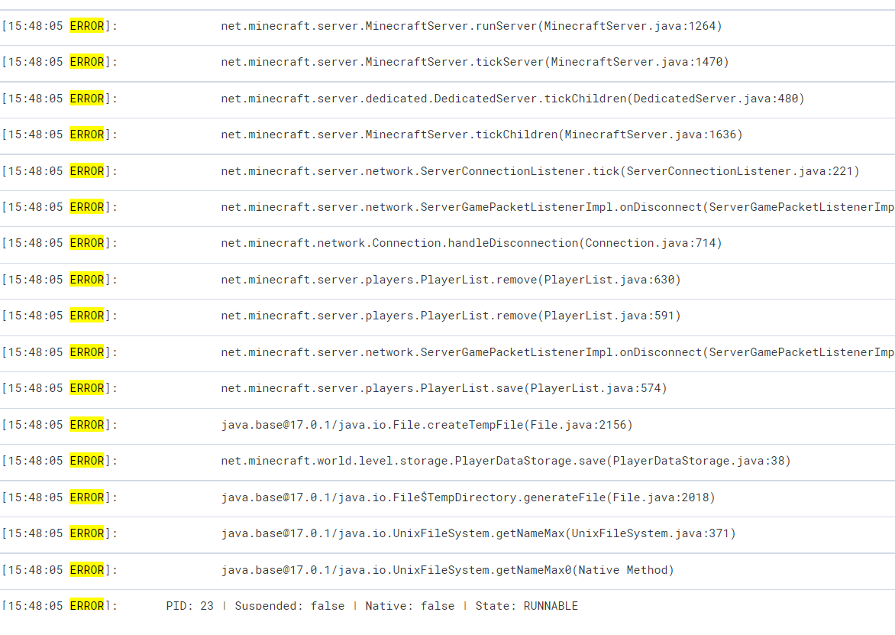

> **_NOTE:_** Error spiked at 20:30, 17:05, 16:25, and 15:48.

After looking at various metrics for CPU, memory, network, and storage, we found the issue in the storage.

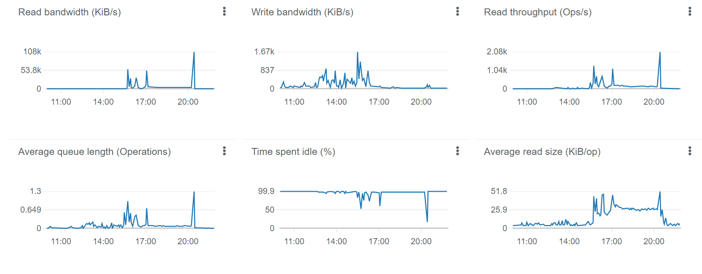

> **_NOTE:_** Read bandwidth also spiked at 20:30, 17:05, 16:25, and 15:48.

Turns out when the operating system is running out of memory, so it writes to a swapfile. A swap is a space on a disk that is used when the amount of physical RAM is full, but the speed of the disk just can't keep up. When swapfile hijacked the storage I/O, Java I/O threads will just hang and time out. Therefore, the solution was to increase the ram of the operating system or decrease the ram allocation of other containers.

> Fun Fact: RAM is 4 to 7 times faster than a Solid State Drive.

## The End

You made it to the end! This over-engineered server does the same thing as you were to launch the jar directly and it is still a vanilla server haha. If you are interested in a tutorial, free feel to leave a comment. Also suggestions and feedback are appreciated!
